# Database Schema

Authoritative Postgres schema for Noni. Reflects every P0 from the architect review: no FK into `auth.users`, idempotent webhooks, per-user estimator state, append-only telemetry, content versioning, RLS-ready.

Status: binding. Referenced by ADRs 0023 (auth and session model) and 0024 (database operational policy).

## Entity-relationship diagram

```mermaid
erDiagram
    accounts ||--o{ learners : "owns"
    accounts ||--o{ sessions : "has"
    accounts ||--o{ purchases_as_buyer : "buyer_of"
    accounts ||--o{ purchases_as_beneficiary : "beneficiary_of"
    accounts ||--o{ entitlements : "holds"
    accounts ||--o{ progress : "produces"
    accounts ||--o{ estimator_state : "has"
    accounts ||--o{ telemetry_events : "emits"
    accounts ||--o{ deletion_requests : "files"

    units ||--o{ progress : "tracked_by"
    units ||--o{ telemetry_events : "context_of"
    products ||--o{ entitlements : "grants"
    products ||--o{ purchases : "purchased_as"

    purchases ||--o| entitlements : "creates"
    purchases }o--|| accounts : "buyer"
    purchases }o--o| accounts : "beneficiary_nullable"

    processed_webhook_events {
        text event_id PK "Stripe event.id"
        text event_type
        timestamptz processed_at
        text idempotency_outcome "granted|refunded|noop|error"
    }

    accounts {
        uuid id PK
        uuid auth_user_id UK "logical ref to Supabase auth.users, NO FK"
        citext email UK
        text display_name
        timestamptz created_at
        timestamptz updated_at
        timestamptz deleted_at "soft delete"
    }

    learners {
        uuid id PK
        uuid account_id FK "= self for adult learner; parent for caregiver case"
        text display_name
        text relationship "self|gift_recipient"
        timestamptz created_at
    }

    sessions {
        uuid id PK
        uuid account_id FK
        text session_token_hash UK "sha256 of cookie value"
        timestamptz issued_at
        timestamptz expires_at
        timestamptz revoked_at "null if active"
        text revocation_reason
        inet last_ip
        text last_user_agent
    }

    products {
        text code PK "e.g. modules_4_5"
        text display_name
        int price_cents
        text currency
        text stripe_price_id
        bool active
        int content_version
    }

    purchases {
        uuid id PK
        uuid buyer_account_id FK
        uuid beneficiary_account_id FK "nullable: gift to be claimed"
        text gift_claim_token UK "nullable; hashed"
        timestamptz gift_claimed_at
        text product_code FK
        int amount_cents
        text currency
        text stripe_payment_intent_id UK
        text stripe_checkout_session_id UK
        text status "pending|paid|refunded|failed"
        timestamptz created_at
        timestamptz paid_at
        timestamptz refunded_at
    }

    entitlements {
        uuid account_id PK
        text product_code PK
        uuid granted_by_purchase_id FK
        int content_version "snapshotted from products at grant time"
        timestamptz granted_at
        timestamptz revoked_at "null if active; set on refund"
        text revocation_reason
    }

    units {
        text id PK "e.g. module_4_unit_2"
        text module_code
        int unit_index
        text title
        text product_code FK "free units have null"
        int content_version
        timestamptz published_at
    }

    progress {
        uuid account_id PK
        text unit_id PK
        int content_version
        text status "started|completed"
        timestamptz first_started_at
        timestamptz completed_at
        int page_count_seen
    }

    estimator_state {
        uuid account_id PK
        text scope PK "e.g. global|unit_id"
        bytea state_blob "serialized covariance + last stability"
        numeric last_stability
        timestamptz updated_at
    }

    telemetry_events {
        bigserial id PK
        uuid account_id FK "nullable for pre-auth events"
        text session_id "hash, nullable"
        text event_type "iscs_decision|envelope_served|unit_view|purchase_*"
        text unit_id FK "nullable"
        jsonb event_metadata
        timestamptz occurred_at
        timestamptz expires_at "for pg_cron retention sweep"
    }

    deletion_requests {
        uuid id PK
        uuid account_id FK
        timestamptz requested_at
        timestamptz scheduled_for "grace period"
        timestamptz completed_at
        text status "requested|cancelled|completed"
    }

    rate_limit_counters {
        text key PK "e.g. signin:ip:1.2.3.4:202605111615"
        int count
        timestamptz window_start
        timestamptz expires_at
    }
```



## Table notes

### Identity boundary

- `accounts.auth_user_id` is a `UUID UNIQUE` referencing Supabase `auth.users.id` **logically, not via FK**. App-layer integrity, vendor independence preserved.
- `accounts.id` is the internal PK and the FK target everywhere else. Supabase user deletion does not cascade into the domain.

### Sessions

- `sessions.session_token_hash` is `sha256` of the cookie value. The plaintext cookie is never stored.
- Revocation is a row update; check on every request is one indexed lookup.

### Purchases and gifts

- `beneficiary_account_id` is nullable: caregiver buys without naming the recipient and gets a `gift_claim_token` (hashed in DB; plaintext only in the receipt email/URL).
- On claim: token verified, beneficiary set, entitlement created, token nulled.

### Entitlements

- PK `(account_id, product_code)` is the hot row; ~100 bytes; page-hot at any scale we will see.
- Refunds set `revoked_at`; grants are never deleted (audit trail).
- `content_version` is snapshotted at grant. A learner keeps the content they paid for even if a newer version is published.

### Webhook idempotency

- `processed_webhook_events` is inserted in the **same transaction** as the entitlement grant. Unique-violation on `event_id` provides the lock.

### Estimator persistence

- `estimator_state` row per `(account_id, scope)`. Restart-safe. Closes the in-memory regression flagged in the architect review.

### Progress / write amplification

- `progress` rows are written only on **unit start** and **unit completion**, not on every page. `page_count_seen` is updated in place; no new row per page.
- High-frequency state (page-by-page) is captured in `telemetry_events` (append-only) instead.

### Content versioning

- `units.content_version`, `products.content_version`, `entitlements.content_version`, `progress.content_version` form a chain of the same int across rows. Mismatch is detectable and surfaced as an envelope decision, not a silent reset.

### Telemetry

- Append-only with `expires_at`. A `pg_cron` job sweeps rows past expiry. Retention policy lives in one place: the default `expires_at` per event type.
- GIN index on `event_metadata` only if support workflow demands it.

### Soft delete and GDPR

- `accounts.deleted_at` for soft delete.
- `deletion_requests` records the user-initiated hard-delete with a grace period. Completion zeroes PII (`email`, `display_name`) but retains anonymized rows where audit requires (purchases, entitlements).

### Rate limits

- `rate_limit_counters` is an application-level fallback when Cloudflare WAF granularity is insufficient. Cleaned by `pg_cron`.

## Indexes

```sql
CREATE INDEX ON accounts (auth_user_id);
CREATE INDEX ON sessions (account_id) WHERE revoked_at IS NULL;
CREATE INDEX ON sessions (expires_at) WHERE revoked_at IS NULL;
CREATE INDEX ON purchases (buyer_account_id, created_at DESC);
CREATE INDEX ON purchases (beneficiary_account_id) WHERE beneficiary_account_id IS NOT NULL;
CREATE INDEX ON purchases (stripe_payment_intent_id);
CREATE INDEX ON entitlements (account_id) WHERE revoked_at IS NULL;
CREATE INDEX ON progress (account_id, status);
CREATE INDEX ON telemetry_events (account_id, occurred_at DESC);
CREATE INDEX ON telemetry_events (expires_at);
-- Add only if support workflow uses it:
-- CREATE INDEX ON telemetry_events USING GIN (event_metadata);
```

## Row Level Security (RLS) policies

All policies live in `supabase/migrations/*.sql`. Summary:

- `accounts`: a row is visible only when `auth.uid() = auth_user_id`.
- All child tables: visible only when `account_id IN (SELECT id FROM accounts WHERE auth_user_id = auth.uid())`.
- `processed_webhook_events`, `products`, `units`: service-role only.
- `entitlements`: read-own; write service-role only.
- `telemetry_events`: insert via service role; read-own restricted to current user.

## Migration ownership

- **Supabase migrations** (`supabase/migrations/`) own DB-level concerns: extensions, RLS policies, `pg_cron` jobs.
- **Alembic migrations** (`backend/alembic/versions/`) own app-level schema: tables, columns, indexes, application FKs.
- Production migration runs as Fly `release_command = "alembic upgrade head"` after `supabase db push` has completed.

## Properties this schema guarantees

| Concern | Mechanism |
|---|---|
| Vendor coupling on identity | `auth_user_id` is logical, no FK |
| Webhook duplication | `processed_webhook_events` |
| Restart regressing learner state | `estimator_state` |
| Refund as audit event | `entitlements.revoked_at`, never DELETE |
| Caregiver gift flow | nullable `beneficiary_account_id` + `gift_claim_token` |
| Content drift | `content_version` chain |
| Unbounded telemetry | `expires_at` + `pg_cron` |
| GDPR deletion | `deletion_requests` + soft-delete + PII-zeroing |
| Session revocation | `sessions.revoked_at` |
| Rate limiting at app layer | `rate_limit_counters` |
