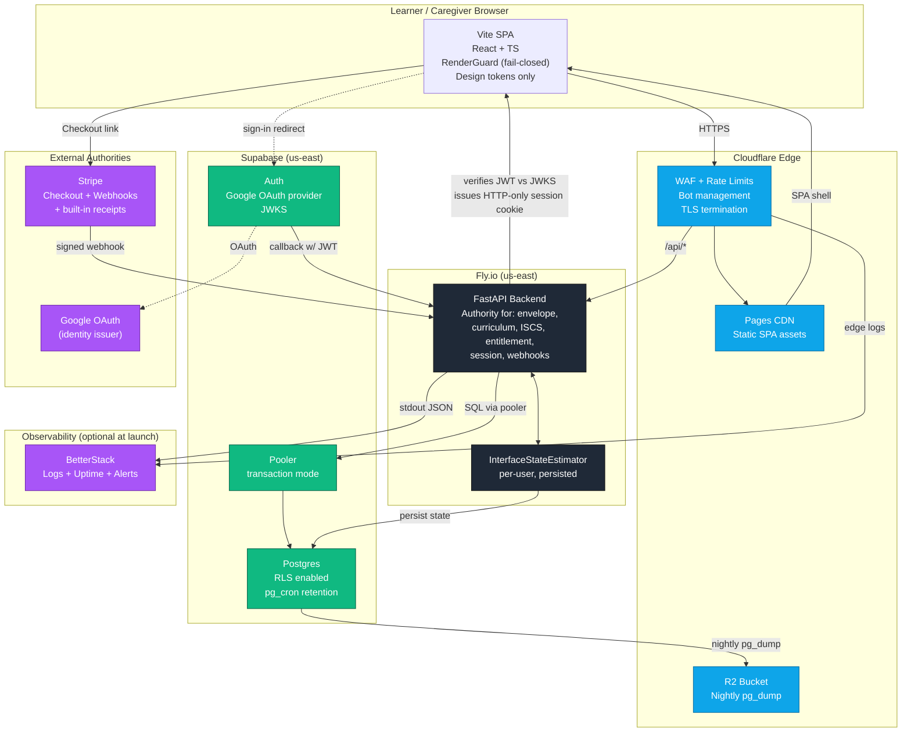

# System Diagram

Authoritative request flow, authority boundaries, and where each contract is enforced.

Status: binding. Referenced by ADRs 0019, 0022, 0023, 0024, 0025.

## Diagram

## Authority rules visible in the diagram

- The SPA never decides anything; it asks the API for an envelope and renders inside `RenderGuard`.
- The API is the only writer to Postgres and the only verifier of JWTs and webhooks.
- Stripe and Google are the only external authorities; everything else is infrastructure.
- The estimator is per-user and persisted; restart-safe.

## Invariants this diagram enforces

1. **No client-supplied trust.** The SPA holds no decision logic; everything renderable comes from an authoritative envelope.
2. **One authority for state.** All Postgres writes route through FastAPI; no direct browser-to-DB path.
3. **One verifier of external claims.** JWT and Stripe webhook signature verification happen in exactly one place.
4. **Restart-safe stability.** The ISCS estimator persists per user; a Fly restart does not silently regress learner state.
5. **Edge does not bypass.** Cloudflare proxies `/api/*` to Fly; the origin is never addressed directly by the browser.
