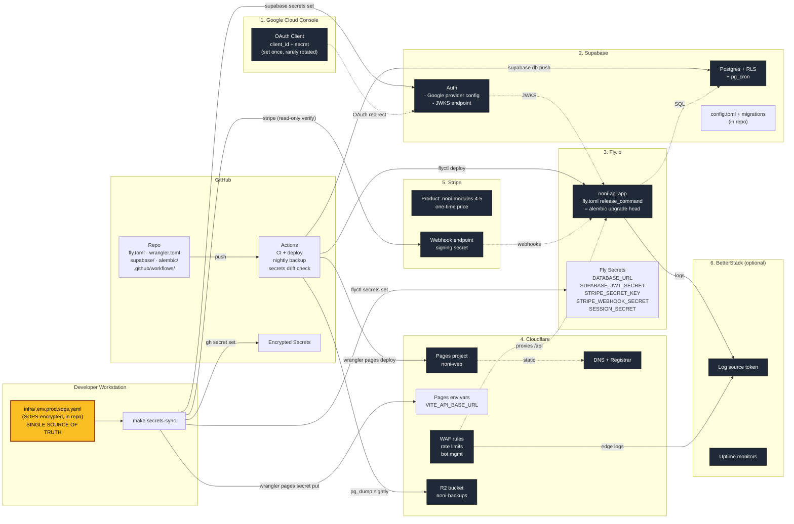

# Third-Party Vendor Topology

How the 5 vendors interconnect, who holds which secret, and what flows where.

Status: binding. Referenced by ADRs 0022 (vendor topology) and 0025 (secrets and configuration management).

## Consolidation principle

Every vendor must earn its slot. A vendor earns its slot only if (a) it is irreducible (Stripe, Google OAuth) or (b) it collapses two or more other vendors into one dashboard and one CLI. Every secret has one source of truth and one command to propagate.

## Vendor set at launch

| # | Vendor | Role | CLI |
|---|---|---|---|
| 1 | Google Cloud Console | OAuth client (touched once at setup) | `gcloud` |
| 2 | Supabase | Auth + Postgres + RLS + pg_cron | `supabase` |
| 3 | Fly.io | FastAPI backend host + secrets | `flyctl` |
| 4 | Cloudflare | Pages, DNS, WAF, R2, Registrar | `wrangler` |
| 5 | Stripe | Checkout, webhooks, receipts | `stripe` |
| 6 | BetterStack (optional at launch) | Logs, uptime, alerts | API |

GitHub is already in the stack for source control and CI; it is not counted as a new vendor.

## Diagram

## Properties this topology guarantees

- **One source of truth (yellow box):** `infra/.env.prod.sops.yaml`. One file, one command (`make secrets-sync`) writes to all five vendors.
- **No secret is typed into a vendor dashboard by hand.** Every line that touches a vendor is a CLI call.
- **No vendor talks to another vendor without crossing the API.** Stripe -> Fly. Google -> Supabase -> Fly. There is no Stripe -> Supabase or Google -> Fly shortcut.
- **Every config artifact lives in the repo:** `fly.toml`, `wrangler.toml`, `supabase/migrations/`, `alembic/versions/`. Bootstrapping from a fresh laptop is `git clone && make bootstrap`.

## Operator surface (daily ops)

| Task | Command | Vendor dashboards touched |
|---|---|---|
| Bootstrap a fresh staging env | `make bootstrap-staging` | 0 |
| Rotate a secret | edit `.env.prod` -> `make secrets-sync` | 0 |
| Deploy backend | `git push` -> CI runs `flyctl deploy` | 0 |
| Deploy frontend | `git push` -> Cloudflare Pages auto-builds | 0 |
| New DB migration | `alembic revision -m ...` -> `git push` | 0 |
| Add a new RLS policy | edit `supabase/migrations/*.sql` -> `supabase db push` | 0 |
| Restore backup drill | `make restore-drill` | 0 |
| Investigate a 3am page | BetterStack URL in the alert email | 1 |

## Trade-offs accepted explicitly

1. **Supabase is the single biggest concentration of vendor risk** (auth + identity + data + RLS + cron). Mitigation: nightly off-platform `pg_dump` to R2 and a documented "migrate to another Postgres in 1 day" runbook.
2. **SOPS + Makefile is a 1-2 person solution.** Trigger to switch to Doppler/Infisical: a third human joins, or `secrets-sync` runs more than once a week.
