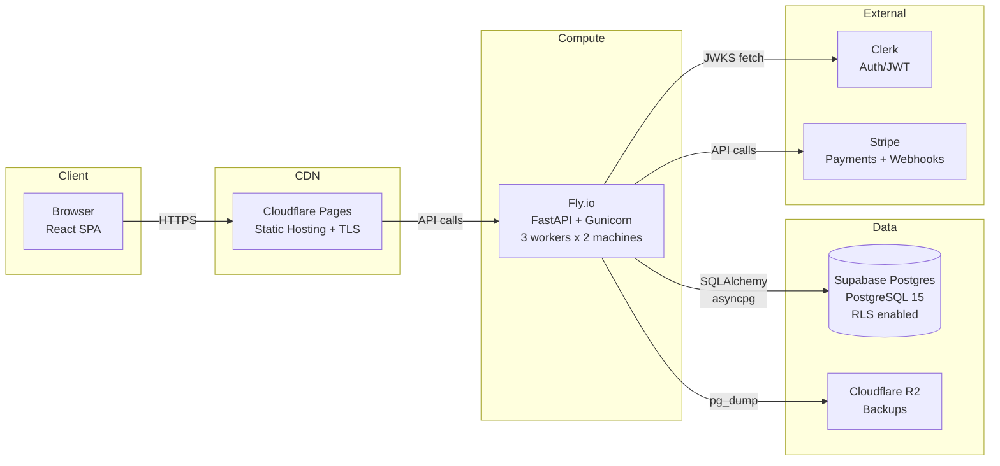

# End-to-End Data Flow

**Version:** 1.0.0
**Last Reviewed:** 2026-05-28

---

## Architecture Overview

```
[Browser] -> [Cloudflare Pages] -> [FastAPI on Fly.io] -> [Supabase Postgres]
                ^                      ^                     ^
           Static assets            Business logic         Persistent data
           (React SPA)              (Python/FastAPI)       (PostgreSQL 15)
```

---

## Component Diagram



---

## Request Flow: Curriculum Page Load

1. **Browser** loads React SPA from Cloudflare Pages
2. **Browser** calls `GET /api/v1/ui-envelope/curriculum.unit`
3. **Fly.io** receives request via Gunicorn -> Uvicorn -> FastAPI
4. **FastAPI** `get_current_account` dependency verifies Clerk JWT via `PyJWKClient`
5. **FastAPI** queries Supabase for curriculum unit content
6. **Supabase** RLS policy ensures account only sees authorized data
7. **FastAPI** returns JSON envelope to browser
8. **Browser** `RenderGuard` validates envelope against contract
9. **Browser** renders curriculum page

---

## Request Flow: Purchase

1. **Browser** clicks "Purchase Modules 4-5"
2. **Browser** calls `POST /api/v1/billing/checkout`
3. **FastAPI** creates `Purchase` row (status: `pending`)
4. **FastAPI** calls Stripe Checkout API
5. **Stripe** returns checkout URL
6. **Browser** redirects to Stripe
7. **User** completes payment on Stripe
8. **Stripe** calls webhook `POST /api/v1/billing/webhook`
9. **FastAPI** verifies webhook signature
10. **FastAPI** updates `Purchase` to `completed`, creates `Entitlement`
11. **FastAPI** logs `billing_event` to telemetry

---

## Data Persistence Points

| Data Type | Stored In | Encrypted? | Backup |
|:---|:---|:---:|:---:|
| Learner accounts | Supabase `accounts` | TLS in transit | R2 daily |
| Curriculum progress | Supabase `progress` | TLS in transit | R2 daily |
| Purchases | Supabase `purchases` | TLS in transit | R2 daily |
| Telemetry events | Supabase `telemetry_events` | TLS in transit | R2 daily |
| Gift tokens | Supabase `gift_tokens` | TLS in transit | R2 daily |
| Sessions (Clerk) | Clerk cloud | Clerk-managed | N/A |
| Backups | Cloudflare R2 | TLS in transit | 30-day retention |

---

## Security Boundaries

| Boundary | Control |
|:---|:---|
| Browser -> API | TLS 1.3, CORS restricted to `noni-web.pages.dev` |
| API -> Database | `sslmode=require`, SQLAlchemy ORM (no raw SQL) |
| API -> Clerk | HTTPS JWKS endpoint, JWT signature verification |
| API -> Stripe | HTTPS API, webhook signature verification |
| Database access | RLS policies on all customer tables |
